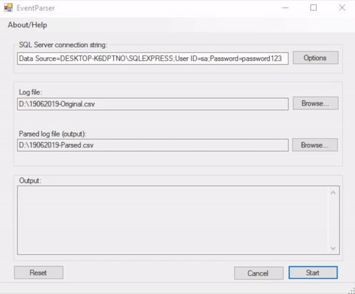

# EventParser

Event logs are generated through the Windows Event Viewer application and can be exported as Comma-Separated Values (CSV) files.
EventParser processes a CSV file, parses the file for specified value(s), creates a new file with the required information, then imports the updated file into an MS SQL database.
EventParser is available with a graphical user interface (GUI) or a command-line interface (CLI).

> EventParser was developed during my internship at the Guyanese Ministry of Finance in July 2019.


---
## Getting Started
###  Prerequisites
* An instance of Microsoft SQL Server 2012
* Visual Studio 2017 (to build the application)

### Installation
#### Local
1. Open the solution file.
2. Build the project.
3. Publish the project.
4. Specify the file path where the setup should be saved.
5. Select CD-ROM as the installation method.
6. Disable updates.
7. Complete the publishing process.
8. Copy the setup to the directory where EventParser will be installed. This is necessary because the setup automatically installs the programme to the directory it is located in. It is recommended that the application be installed on the root directory of the machine.
9. Run the setup.

#### Server
Execute the `BulkInsert_StoredProcedure.sql` file. This script installs the Stored Procedure onto the MS SQL Server. 
The Stored Procedure imports the CSV file into the database and creates a table on the first run.

---
## Usage
### GUI
1. Run the programme with administrator privileges.
2. Set the connection string. Select Options. Complete the necessary fields then click OK.
3. Specify the filepath of the CSV file to be opened.
4. Specify the filepath of the CSV file to be saved. An existing file may be overwritten, or a new file can be created.
5. Select the OK button.
6. Check the Output field to see the application’s progress. Ideally, this should be the application output.
```
Begin processing *FILENAME*
Replacing log file header…
Parsing log file…
Importing log file into MSSQL server…
Done.
```

_To clear all the fields and restart the application, select the “Reset” button._

_The connection string is automatically saved each time the programme is run._


### CLI
Run the programme with administrator privileges. The console application supports three arguments. Each argument **MUST** be wrapped in double quotes. 

```
        -i, —input… Specify filepath of CSV file to process

        -o, —output… Specify filepath to save CSV file

        -c, —connection… Specify connection string
```

---
## Libraries
[CSVHelper](https://www.nuget.org/packages/CsvHelper/) - Allows for reading and writing CSV files; enables significantly faster processing.

[CommandLineArgumentsParser](https://www.nuget.org/packages/CommandLineArgumentsParser/) - Allows command-line arguments to be passed to the CLI.

---

## Programme Structure
#### AddMissingHeader
The exported CSV file has a missing column header. This method reads the CSV file and replaces the existing header row with a corrected version. A FileStream instance is opened. The file is overwritten. The existing header is found through a Regular Expressions (RegEx) expression. This is necessary as CSVHelper requires the column names to be defined (`DataRecord.cs`).

#### ParseLog
This method uses CSVHelper. This method reads the CSV file. These columns are: `Level, Date and Time, Source, Event ID, Task Category`. A FileStream instance is opened to read/write to the file. The log file is read into an enumerable. A RegEx expression is used to match the value to be extracted. 
Additional fields may be needed to be extracted from the `Details` column. There is uncommented code that gives an example on how to extract an additional field. 
None of the fields present in the CSV file are unique. A primary key has been created by combining the timestamp with an increment. 
There are instances of records which contain no `Account Name` in the `Details` column. If there is no `Account Name` to be extracted, the following row gets inserted into the account name field. This causes errors during importing. 
#### ImportToMSSQL
This method imports the CSV file into the MS SQL database. This is facilitated by the `ImportLogs` Stored Procedure. The file path of the parsed CSV file is passed to the Stored Procedure as a parameter. 
The Stored Procedure creates a table `event_logs` if it does not already exist. It imports the CSV file into the database via Bulk Inserts. The script must be built as a string because the Bulk Insert command does not accept file path as a parameter. 

---

## Automation
In order to make this an automated process, a batch file may be created which runs the CLI version of EventParser. As EventParser supports command line arguments, the file paths and connection strings may be passed to the CLI through the batch file.
The batch file can be run automatically at scheduled intervals via Task Scheduler.

---

## Future Implementation
- Transactional writes for bulk inserts
- Automatic generation of Event Viewer Logs
- Removal of ‘bad’ events from log file (Logs with missing details and duplicates) 

---

## License
This project is licensed under the MIT License - see the [LICENSE.md](https://github.com/isaac3954/event-parser/blob/master/LICENSE.md) file for details.
